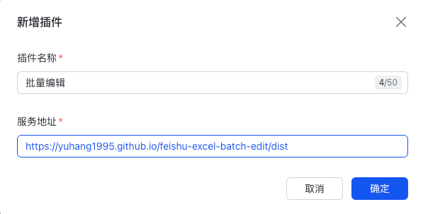

# 飞书多维表格批量编辑插件

一个用于飞书多维表格的自定义插件，帮助你按条件筛选记录，并对同一字段执行批量更新。

## 这个插件能做什么

- 按当前表内条件筛选命中的记录
- 对选中的字段执行批量修改
- 支持根据字段类型选择常用筛选操作符
- 展示全部字段，其中只读字段和计算字段会显示但不可修改

适合需要一次性更新多行数据、减少重复手动编辑的场景。

## 使用方法

### 1. 在飞书多维表格中创建自定义插件

在多维表格中依次进入：`插件` -> `自定义插件`

<p align="center">
  
  
</p>

填写插件信息，并在插件地址中输入：

`https://yuhang1995.github.io/feishu-excel-batch-edit/dist`

<p align="center">
  
</p>

添加成功后即可在插件列表中看到它。

<p align="center">
  
</p>

### 2. 打开插件并开始批量修改

进入插件后，按下面顺序操作：

1. 选择数据表和视图
2. 添加筛选条件
3. 点击“加载筛选结果”
4. 选择要修改的字段
5. 输入目标值并执行“批量更新”

<p align="center">
  
</p>

## 使用说明

- 筛选只作用于当前表内的数据
- 批量修改一次只针对一个目标字段
- 只读字段、计算字段或当前不支持写入的字段不可批量修改
- 执行前建议先用少量数据测试，确认筛选条件无误

## 本地开发

### 安装依赖

```bash
pnpm install
```

### 启动开发环境

```bash
pnpm run dev
```

### 本地构建

```bash
pnpm run build
```

构建产物会输出到 `dist/` 目录。

## 发布说明

项目使用 GitHub Actions 自动构建 `dist/`：

- 当 `main` 分支有新的 push 时，会自动执行 `pnpm run build`
- 如果 `dist/` 有变化，Action 会自动将变更提交回 `main`

如果你是手动发布，也可以在提交前先本地执行一次：

```bash
pnpm run build
```

## 技术栈

- React
- TypeScript
- Vite
- `@lark-base-open/js-sdk`
- `@douyinfe/semi-ui`
